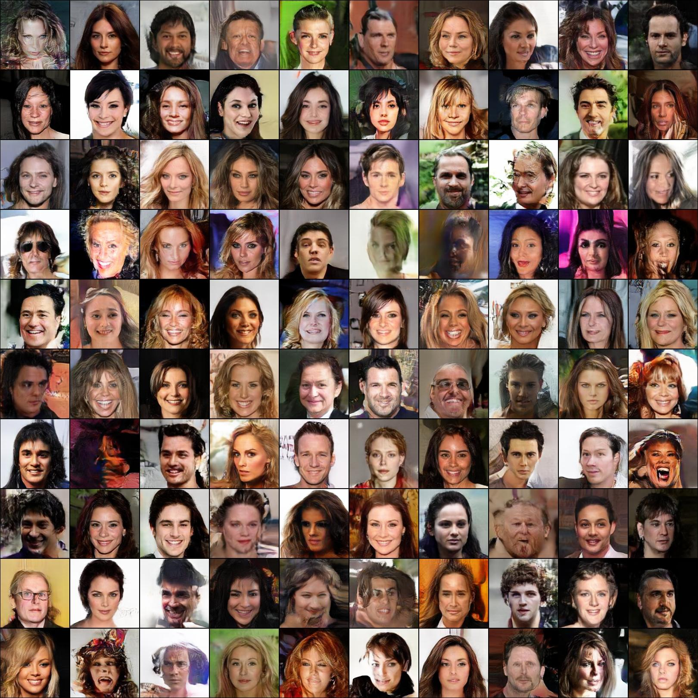

# Weight Normalized GAN
Code for the paper "[On the Effects of Batch and Weight Normalization in Generative Adversarial Networks]( https://arxiv.org/abs/1704.03971)".

## About the code
Here two versions are provided, one for torch and one for PyTorch.

The code used for the experiments in the paper was in torch and was a bit messy, with hand written backward pass of weight normalized layers and other staff used to test various ideas about GANs that are unrelated to the paper. So we decided to clean up the code and port it to PyTorch (read: autograd). However, we are not able to exactly reproduce the results in the paper with the PyTorch code. So we had to port it back to torch to see the difference.

We did find and fix a mathematical bug in gradient computation (Ouch!) in our implementation of weight normalization, which means that the code used for the paper was incorrect and you might not be able to exactly reproduce the results in the paper with the current code. We need to redo some experiments to make sure everything still works. It seems that now a learning rate of 0.00002 gives very good samples but the speed is not very impressive in the beginning; 0.0001 speeds up training even more than in the paper but give worse samples; 0.00005 balances between the two and also give lower reconstruction loss than in the paper. The example below uses 0.00002.

That being said, we can still find some differences in the samples generated by the two versions of code. We think that the torch version is better, so you are adviced to use that version for training. But you should definitely read the PyTorch version to get a better idea of how our method works. We checked this time that in the torch code, the computed gradients wrt the weight vectors are indeed orthogonal to the weight vectors, so hopefully the difference is not caused by another mathematical bug. It could be a numerical issue since the gradient are not computed in exactly the same way. Or I might have made stupid mistakes as I have been doing machine learning for only half a year. We are still investigating.

## Usage
The two versions accept the exact same set of arguments except that there is an additional option to set ID of gpu to use in the torch version.

Before training, you need to prepare the data. For torch you need [lmdb.torch](https://github.com/eladhoffer/lmdb.torch) for LSUN and [cifar.torch](https://github.com/soumith/cifar.torch) for CIFAR-10. Split the dataset into training data and test data with `split_data.lua/py`. Use `--running` and `--final` to set number of test samples for running test and final test respectively.

The LSUN loader creates a cache if there isn't one. It takes some time. The loader for custom dataset from a image folder requires images of each class to be in one subfolder, so if you use say CelebA where there is no classes you need to manually create a dummy class.

To train, run `main.lua/py`. The only ones you must specify are the `--dataset`, `--dataroot`, `--save_path` and `--image_size`. By default it trains a vanilla model. Use `--norm batch` or `--norm weight` to try different normalizations.

The width and the height of the images are not required to be equal. Nor do they have to be powers of two. They only have to both be even numbers. Image size settings work as follows: if `--crop_size` is specified or if both `--crop_width` and `--crop_height` are specified, the training samples are first cropped to the center. Then, if `--width` and `--height` are both specified, the training samples are resized to that size. Otherwise, they are resized so that the aspect ratio is kept and the length of the shorter edge equals `--image_size`, and then cropped to a square.

If `--nlayer` is set, that many down/up concolution layers are used. Otherwise such layers are added until the size of the feature map is smaller than `8x8`. `--nfeature` specifies the number of features of the first convolution layer.

Set `--load_path` to continue a saved training.

To test a trained model, use `--final_test`. Make sure to also use a larger `--test_steps` since the default value is for the running test during training. By default it finds the best model in `load_path`, to use another network, set `--net`

Read the code to see how other arguments work.

Use `plot.lua/py` to plot the loss curves. The PyTorch version uses [PyGnuplot](https://pypi.python.org/pypi/PyGnuplot) (it sux).

## Example

`th main.lua --dataset folder --dataroot /path/to/img_align_celeba --crop_size 160 --image_size 160 --code_size 256 --norm weight --lr 0.00002 --save_path /path/to/save/folder`

This should give you something like this in 200,000 iterations:

## Additional notes
The WN model might fail in the first handful of iterations. This happens especially often if the network is deeper (on LSUN). Just restart training. If it get past iteration 5 it should continue to train without trouble. This effect could be reduced by using a smaller learning rate for the first couple of iterations.

## Extra stuff
At request, added `--ls` flag to use least square loss.
